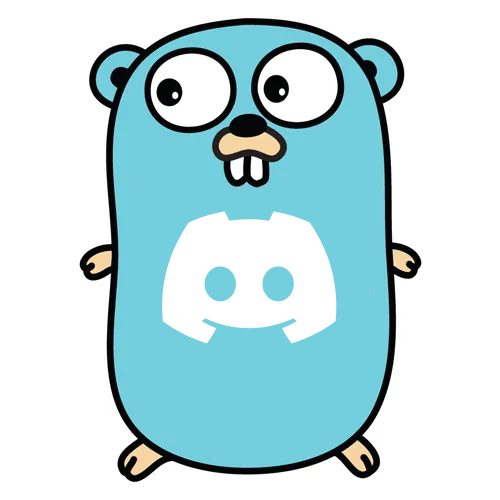

  

<h3 align="center">PXE-Server</h3>

  

    A full-featured PXE server for network booting, designed to be easy to use and highly customizable.
     
    <a href="https://github.com/RealZone22/DiscordBot/blob/main/DOCS.md"><strong>📖 Explore the docs »</strong></a>
     
     
    <a href="https://github.com/RealZone22/DiscordBot/issues/new?labels=bug&template=bug.yml">🐛 Report Bug</a>
  

## Security Vulnerabilities

Please review [our security policy](SECURITY.md) on how to report security vulnerabilities.

## Contributing

Please see [CONTRIBUTING](CONTRIBUTING.md) for details.

## License

Please see [License File](LICENSE) for more information.

  

<h3 align="center">PXE-Server</h3>

  

    A full-featured PXE server for network booting, designed to be easy to use and highly customizable.
     
    <a href="https://github.com/RealZone22/DiscordBot/blob/main/DOCS.md"><strong>📖 Explore the docs »</strong></a>
     
     
    <a href="https://github.com/RealZone22/DiscordBot/issues/new?labels=bug&template=bug.yml">🐛 Report Bug</a>
  

## Security Vulnerabilities

Please review [our security policy](SECURITY.md) on how to report security vulnerabilities.

## Contributing

Please see [CONTRIBUTING](CONTRIBUTING.md) for details.

## License

Please see [License File](LICENSE) for more information.

